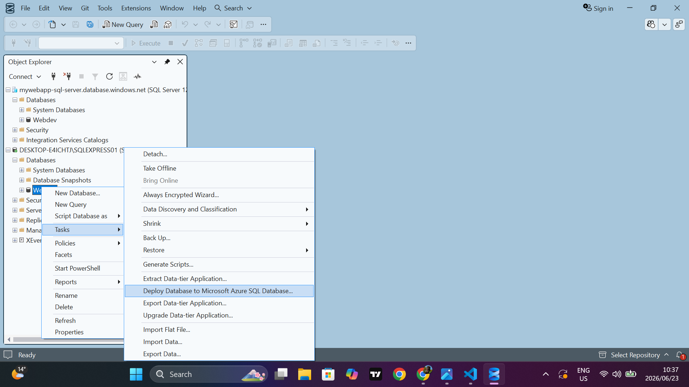

# Database Migration From Local Server To Azure Sql Cloud Server
Database migration project showcasing Azure SQL Database deployment, secure SSMS connectivity, and successful migration from on-prem SQL Server to Cloud server(Azure). This will enable my website to connect to database online once it live, since a local sql serevr is only limited to local use, only good for testing purposes.

First we create an SQL database in Azure(this is where we are migrating to):

Then we 

