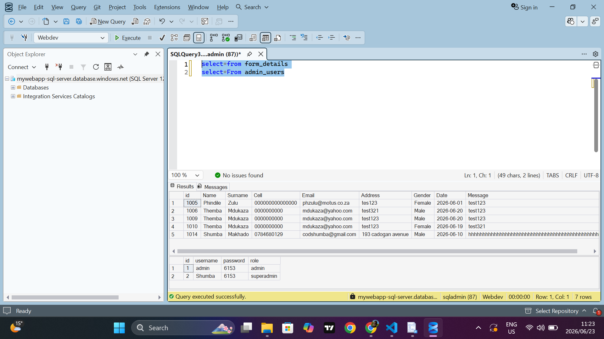

# Database Migration From Local Server To Azure Sql Cloud Server
Database migration project showcasing Azure SQL Database deployment, secure SSMS connectivity, and successful migration from on-prem SQL Server to Cloud server(Azure). This will enable my website to connect to database online once it live, since a local sql serevr is only limited to local use, only good for testing purposes.

 
First we create an SQL database in Azure(this is where we are migrating to):
 

Create Resource group and name the Database(NB! this should be the same as the local database you want migrate):

Now I created a server that I will later use to connect Azure Database to SQL Server Management Studio (SSMS) allowing me o manage it form there:

I used "SQL authentication" as a authentication method. This will later make connecting the server to SSMS seamless later on:

Reviewing my configs:

I am deploying now:

Closely monitoring deployment to see if everything is deploying correctly:

Deployment was a success:

I made sure the resources were really deployed: 

Here I was configuring my Network settings to allow me to connect to this database via SQL Server Management Studio, basically making it publicly accessible:

I added an IPv4 address which will allow me to connect to connect and communicate with this server:

Network Settings were succesfully configured:

Connecting to local Server to prepare for exporting/migration:

Looking for my Database:

Making sure all the tables I want are there:

Now we connect to the Azure SQL server to SSMS start migrating the database:

Azure SQL server connected to SSMS successfully:

Checking if the Database we created in the begining is present

Now we go back to the local server:

Locating the database I want to migrate:

Right clicked to go to tasks and then find "Export Data...", this is where the migration happens:

SQL Server Import and Export Wizard (the migration tool) opens:

Here I had to lacate the data source which is my local server and the database I am migrating

